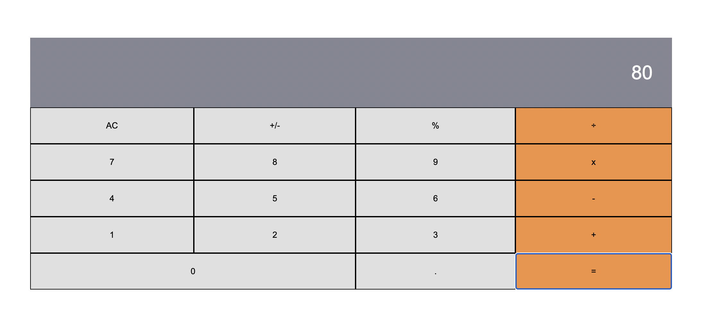

# Math Magicians

Math Magicians is a website for all fans of mathematics. It is a Single Page App (SPA) that allows users to make simple calculations and Read a random math-related quote.

Additional description about the project and its features.

## Built With

- JavaScript
- React
- HTML, CSS, JSX, WebPack, Git, GitHub

## Steps to run the project in your local machine

Go To Terminal and paste the following command:

`git clone git@github.com:zainsadaqat/math-magicians.git`

`cd math-magicianss`

`npm start`

## Authors

👤 **Zain Sadaqat**

- GitHub: [ZainSadaqat](https://github.com/zainsadaqat)
- Twitter: [ZainSadaqat](https://twitter.com/zain_sadaqat)
- LinkedIn: [ZainSadaqat](https://linkedin.com/in/zain-sadaqat)

## 🤝 Contributing

Contributions, issues, and feature requests are welcome!

Feel free to check the [issues page](../../issues/).

## Show your support

Give a ⭐️ if you like this project!

## Acknowledgments

- Hat tip to anyone whose code was used
- Inspiration
- etc

## 📝 License

This project is [MIT](./MIT.md) licensed.
